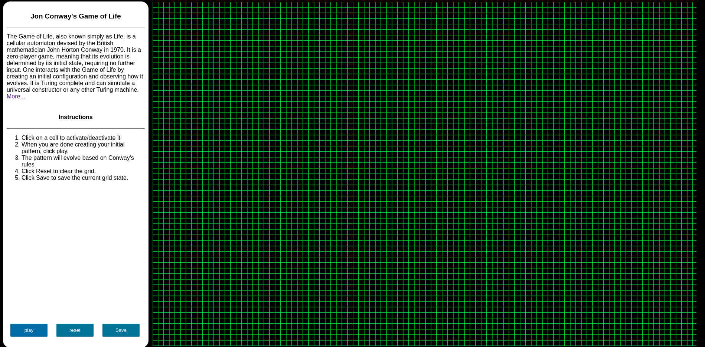
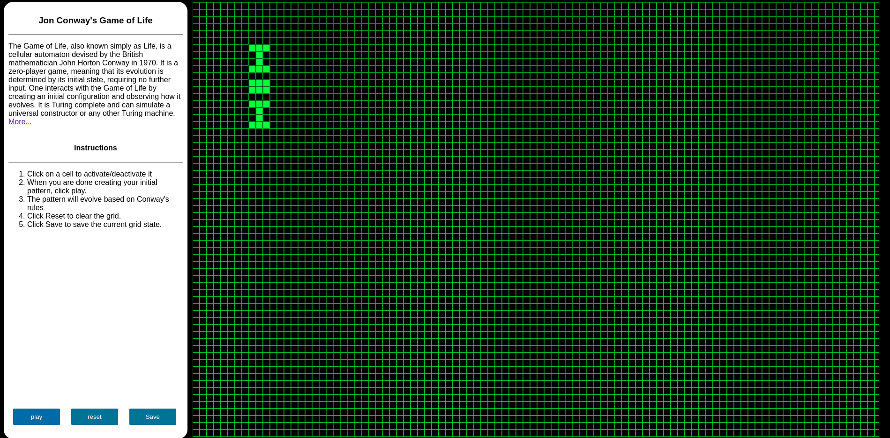
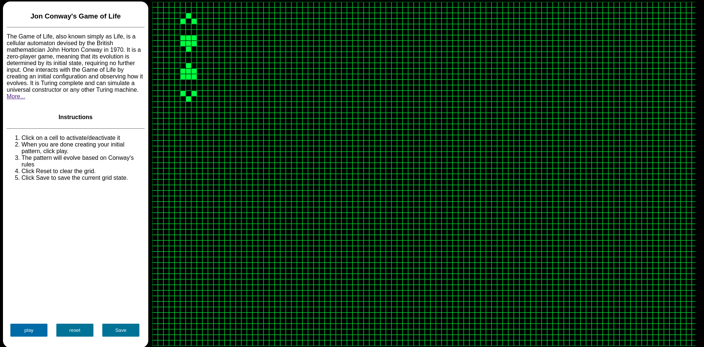

# Game of Life

This Projects attempt to simulate Jon Conway's game of life, played on an infinite 2-D grid. Jon's game is a mathematical game that deals with cellular automation, bound by these 4 simple rules.

1. Any live cell with fewer than two live neighbours dies, as if by underpopulation.
2. Any live cell with two or three live neighbours lives on to the next generation.
3. Any live cell with more than three live neighbours dies, as if by overpopulation.
3. Any dead cell with exactly three live neighbours becomes a live cell, as if by reproduction.

# Objectives

My goal for this project was pretty simple and straightforward, I did it for fun. This game was a challenge for me that I wanted to explore and see if I could write a grid that can simulate these rules effective enough, as well as enjoy myself with the fun involved in writing and optimising grid scanners.

This project had these objectives:
1. Explotr Cellular Automation - As much as it was fun coding this game, I also learnt some interesting concepts involved in the divide and conquer strategy, since the cells are only doing a really small job, dead or alive, but from such small change, carried our acrossed the grid resulted in very impressive results which opened up my mind to other coding ideas and possible was I could solve other problems using this method.

2. The Grid changes size based on the device screen size - The object was to see how best can my scanner do in bigger screen sizes, because cell size is constant across devices which means bigger screen, more cells.

# Tech Stack 

- JavaScript 
- HTML
- CSS
- Createjs Library.

# Build

**Requirements**
    
    1. Web Browser
    2. Internet Connection

**Build**

    Navigate to the src folder and run the open the Index file on the browser.

# Usage

>[Jon Conway's Game of Life Guide](https://en.wikipedia.org/wiki/Conway%27s_Game_of_Life)

# Preview

# Review

* This Project could use some improvement in UI design.
* I still need to implement the Zoom-in, Zoom-out of the grid functionality.
* Grid Responsiveness.